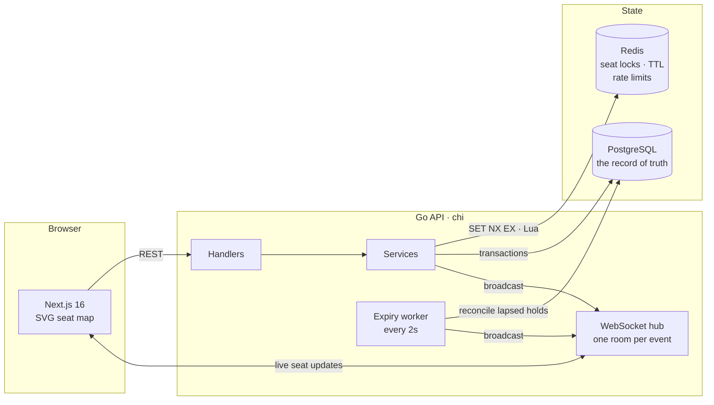
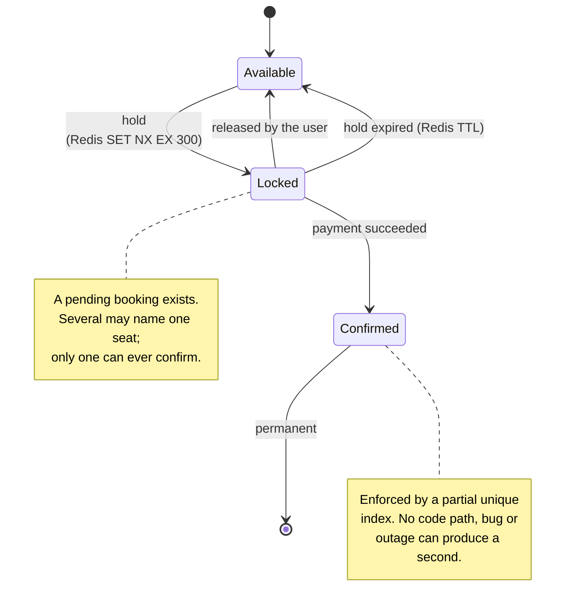
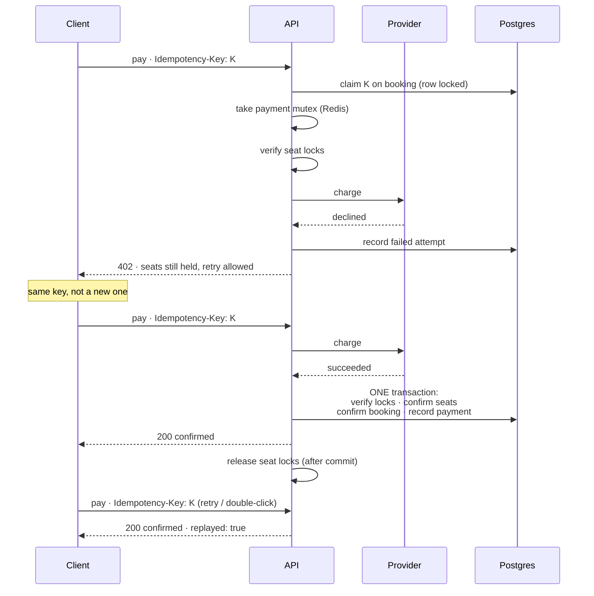

# SeatSync

[](https://github.com/Aryan-Jain06/seatsync/actions/workflows/ci.yml)

A high-concurrency event ticket booking platform. Users browse events, see a
live seat map, hold seats for five minutes, and pay.

The hard part is the one line of behaviour everything else exists to protect:

> If five hundred people try to book the same fifty seats at the same instant,
> exactly fifty bookings succeed and no seat is ever sold twice.

That claim is not asserted here. It is proved by an automated load test whose
result is reproduced further down, and re-checked directly against the
database afterwards.

---

## Contents

- [What it does](#what-it-does)
- [Architecture](#architecture)
- [The seat lifecycle](#the-seat-lifecycle)
- [Why Redis locks *and* a Postgres index](#why-redis-locks-and-a-postgres-index)
- [Idempotency](#idempotency)
- [The proof](#the-proof)
- [Running it](#running-it)
- [API](#api)
- [Configuration](#configuration)
- [Tests](#tests)
- [Project layout](#project-layout)

---

## What it does

| | |
|---|---|
| **Browse** | Events with venue, date and live availability |
| **Seat map** | Every seat, priced, colour-coded by state, updating live over WebSocket |
| **Hold** | Up to six seats, reserved for five minutes, all or nothing |
| **Pay** | Mock provider, idempotent, safe to retry |
| **Confirm** | The seats become permanently yours |

Payments are simulated. There is no gateway, no card, and nothing is charged.

---

## Architecture



Two stores, each doing what it is good at.

**Redis** holds the transient claim. A lock is a key that expires by itself,
which is exactly the shape of a five-minute hold: nobody has to remember to
clean it up, and a crashed server does not strand a seat.

**PostgreSQL** holds the permanent record and the invariant. A sale is a row,
and a partial unique index makes a second sale of the same seat impossible.

---

## The seat lifecycle



A seat returns to `Available` two ways, and the distinction matters:

- **Redis expires the lock.** The seat is instantly bookable again. Nothing
  needs to run for this to happen.
- **The worker reconciles Postgres.** Every two seconds it marks the abandoned
  bookings `expired` and tells connected clients. This is bookkeeping, not
  gating: if the worker died, seats would still free correctly.

Measured, with a four-second hold:

```
T+3.6s   held=2   booking=pending
T+4.3s   held=0   booking=pending     <- Redis TTL lapsed; seat bookable again
T+5.1s   held=0   booking=expired     <- worker caught up
```

---

## Why Redis locks *and* a Postgres index

They solve different problems, and neither alone is sufficient.

**Redis prevents contention.** Five hundred people click at once; 450 are told
"taken" in a millisecond, without ever touching Postgres. This is a
performance and user-experience mechanism. It is fast, and it can be wrong:
a lock can expire a microsecond after it is checked, Redis can fail over and
lose a key, a network partition can hand the same lock to two callers.

**Postgres guarantees correctness.** The index is not an optimisation:

```sql
CREATE UNIQUE INDEX uq_booking_seats_confirmed_seat
    ON booking_seats (event_id, seat_id)
    WHERE confirmed;
```

The `WHERE confirmed` is the whole trick. Rows for *pending* bookings are not
covered, so many people may hold pending bookings over one seat — which is
what makes a race possible in the first place. The moment a booking confirms,
its rows enter the index, and the second one to arrive is rejected by the
database itself.

So: **Redis decides who gets to try. Postgres decides who actually won.**

Ask what happens if you delete one:

| Removed | Consequence |
|---|---|
| The Redis lock | Still correct, never double-sells. But 500 people all reach payment, 450 get charged-then-refused. Awful UX, pointless load. |
| The Postgres index | Fast and pleasant, until Redis hiccups once. Then two people own seat A-12 and you find out from a customer. |

The index is the one that must never be removed. It is the only component
whose failure mode is *silent*.

---

## Idempotency

`POST /bookings/{id}/pay` requires an `Idempotency-Key` header. The browser
generates one UUID per checkout and reuses it for every retry.



Four things make a double charge impossible:

1. **The key is claimed under a row lock**, so a booking binds to one attempt.
2. **A Redis mutex** stops two requests reaching the provider at all. The
   database would catch a double *confirmation*, but only after the money
   moved. Against a real gateway, that is the difference between one charge
   and two.
3. **A confirmed booking replays** its stored result instead of charging.
4. **`uq_payments_one_success_per_booking`** refuses a second successful
   payment even if every layer above it failed.

A decline leaves the booking `pending` and the seats held, so the user retries
until the hold lapses. Every attempt is recorded, so a booking carries its
declines alongside the eventual charge.

Verified at the network layer — three attempts during a forced-decline run:

```
pay attempts made : 3
distinct keys used: 1
```

---

## The proof

```bash
make up            # or: docker compose up -d
make loadtest
```

500 virtual users, one booking attempt each, 50 seats. Seats are assigned by
iteration rather than at random, so every seat is contested by exactly ten
callers and none is left untouched by chance.

```
─────────────────────────────────────────────────────────
  SEATSYNC CONCURRENCY PROOF
─────────────────────────────────────────────────────────
  Booking attempts                                     500
  Seats available                                       50

  Confirmed bookings                     50  (expected 50)
  Conflicts on hold (409)                              450
  Conflicts on pay (409)                                 0
  Total clean conflicts                450  (expected 450)
  Unexpected outcomes                                    0
  Outcomes accounted for                         500 / 500

  Latency p95 (all requests)                      327.7 ms
  Latency p99 (all requests)                      355.1 ms
  Latency median                                  264.4 ms
  Latency max                                     362.7 ms
─────────────────────────────────────────────────────────
  PASS  exactly 50 seats sold, 450 attempts rejected cleanly
─────────────────────────────────────────────────────────
```

Then, asked of the database directly rather than of the API:

```
──────────────────────────────────────────────────────────
  DATABASE VERIFICATION
──────────────────────────────────────────────────────────
  Duplicate confirmed (event, seat) pairs : 0
  Confirmed bookings without a payment    : 0
  Successful payments without a booking   : 0
  Seats flagged sold on an unsold booking : 0
  Bookings charged more than once         : 0
──────────────────────────────────────────────────────────
  PASS  every invariant holds
──────────────────────────────────────────────────────────
```

The two checks are deliberately independent. k6 reports what the API told it;
the SQL asks what is actually stored. A bug that made the API report success
wrongly would still be caught by the second.

At 20:1 contention (`ATTEMPTS=1000`) the result is unchanged: **50 confirmed,
950 clean conflicts, zero duplicates.**

The core query, straight from the brief:

```sql
SELECT event_id, seat_id, COUNT(*)
FROM booking_seats
WHERE confirmed
GROUP BY 1, 2
HAVING COUNT(*) > 1;
--  0 rows
```

---

## Running it

**Requirements:** Docker and Docker Compose. Go 1.24+ and Node 20+ only if you
want to run the services outside containers.

```bash
git clone https://github.com/Aryan-Jain06/seatsync.git
cd seatsync

cp .env.example .env
docker compose up -d --build

# Load the demo data: 2 venues, 4 events, 400 seats each
docker compose exec backend /seed
```

Open **http://localhost:3000**.

Sign in with `demo@seatsync.dev` / `password123`, or create an account.

To see the live seat map working, open the same event in two browser windows
and hold seats in one. The other updates without a reload.

### Running the pieces individually

```bash
make infra          # just postgres + redis
make migrate        # apply migrations
make seed           # demo data
make run            # backend on :8080
make web            # frontend on :3000
```

`make help` lists every target.

---

## API

| Method | Path | Auth | Notes |
|---|---|---|---|
| `POST` | `/auth/register` | — | Returns access + refresh tokens |
| `POST` | `/auth/login` | — | |
| `POST` | `/auth/refresh` | — | Rotates the refresh token |
| `POST` | `/auth/logout` | — | Revokes a refresh token |
| `GET` | `/auth/me` | Bearer | |
| `GET` | `/events` | optional | |
| `GET` | `/events/{id}` | optional | |
| `GET` | `/events/{id}/seatmap` | optional | Signed-in callers also get `held_by_me` |
| `POST` | `/events/{id}/holds` | **Bearer** | Max 6 seats, all or nothing |
| `DELETE` | `/holds/{booking_id}` | **Bearer** | |
| `GET` | `/bookings/{booking_id}` | **Bearer** | |
| `POST` | `/bookings/{booking_id}/pay` | **Bearer** | Requires `Idempotency-Key` |
| `GET` | `/me/bookings` | **Bearer** | |
| `GET` | `/ws/events/{id}` | optional | WebSocket |
| `GET` | `/health`, `/health/ready` | — | |

Errors are uniform, with a stable machine-readable code:

```json
{
  "error": {
    "code": "seats_unavailable",
    "message": "Some of those seats are already held by someone else.",
    "details": { "unavailable_seat_ids": ["…"] }
  }
}
```

### Protection

Every route is rate limited by token bucket in Redis, so several API
instances share one allowance per caller rather than one each. Authenticated
callers are metered by user id, anonymous ones by address.

| Class | Default | Guards against |
|---|---|---|
| `/auth/*` | 10 burst, 10/min | Password guessing |
| Reads | 120 burst, 240/min | Scraping |
| Writes | 30 burst, 60/min | Hold and payment abuse |

Set `REQUIRE_AUTH_FOR_BROWSING=true` to close the catalogue and seat map to
anonymous callers entirely.

Deployment hardening — TLS, secrets, WAF, managed Redis and Postgres, CI/CD —
is covered in **[DEPLOYMENT.md](DEPLOYMENT.md)**.

---

## Configuration

Everything is environment driven and documented inline in
[`.env.example`](.env.example). The settings that matter most:

| Variable | Default | |
|---|---|---|
| `JWT_SECRET` | dev value | **Must** be changed outside development |
| `HOLD_TTL` | `5m` | How long a hold survives |
| `MAX_SEATS_PER_HOLD` | `6` | |
| `EXPIRY_SWEEP_INTERVAL` | `2s` | |
| `PAYMENT_MODE` | `random` | `random` (90% success), `always_success`, `always_fail` |
| `RATE_LIMIT_ENABLED` | `true` | |
| `TRUST_PROXY_HEADERS` | `false` | Enable only behind a proxy you control |

---

## Tests

```bash
make test         # everything
make test-race    # with the race detector
make cover        # HTML coverage report
```

54 tests, all passing under `-race`. Every push runs them in CI, together with
the 500-request concurrency proof — so the guarantee at the top of this file is
re-verified on every commit, publicly, in the
[Actions tab](https://github.com/Aryan-Jain06/seatsync/actions).

The ones worth knowing about:

| Area | Covers |
|---|---|
| `internal/repos` | The confirm transaction. 20 transactions racing to confirm one seat yield exactly one sale, with nothing half-written. Idempotency claim and replay. |
| `internal/locks` | 100 goroutines racing for one seat yield one winner. All-or-nothing acquisition. Release refuses to touch another caller's lock. |
| `internal/realtime` | Slow clients are evicted, not waited on. 20 connect/disconnect cycles leak no goroutines. `Close` genuinely drains. |
| `internal/ratelimit` | 100 concurrent callers get exactly the burst, never more. |
| `internal/auth` | JWT `alg=none` downgrade and signature tampering are refused. |
| `internal/services` | Seat map merge: confirmed always beats a stale hold. |

The `repos`, `locks` and `ratelimit` suites need Postgres and Redis running
(`make infra`); they skip cleanly if neither is reachable.

---

## Project layout

```
backend/
  cmd/
    server/            the API
    migrate/           schema migrations
    seed/              demo data
    loadtest/          provisions the concurrency proof
  internal/
    auth/              JWT and refresh tokens
    config/            environment configuration
    db/                pool and embedded migrations
    handlers/          HTTP layer, no business logic
    httpx/             typed API errors, JSON helpers
    locks/             Redis seat locking (3 Lua scripts)
    middleware/        auth, logging, recovery, rate limiting, headers
    models/            domain types
    payments/          provider interface and the mock
    ratelimit/         token bucket
    realtime/          WebSocket hub
    repos/             data access
    server/            router assembly
    services/          business logic
  migrations/          SQL

frontend/
  src/app/             pages (App Router)
  src/components/      seat map, checkout, countdown
  src/lib/             API client, realtime hook, auth context

loadtest/
  booking.js           the k6 proof
  verify.sh            independent SQL verification
  run.sh               orchestrates both
```

---

## Further reading

**[EXPLANATION.md](EXPLANATION.md)** — a plain-language walkthrough of every
component, every design decision and the alternatives that were rejected, plus
answers to the hardest questions this project invites.

**[DEPLOYMENT.md](DEPLOYMENT.md)** — what to add to run this for real, and how.
